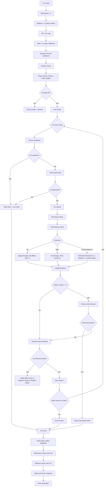

```mermaid
flowchart TD

%% --- TURN START ---
A[Turn Start] --> A1[Momentum = 0]
A1 --> A2[Balance = 0 unless locked]
A2 --> A3[RP +2 to cap]
A3 --> A4[Heat = 0 unless stabilized]
A4 --> A5[Statuses and tick cooldowns]
A5 --> B[Declare Chain]

%% --- DECLARE CHAIN ---
B --> B1[Player selects actions, order, targets]
B1 --> B2{Enough RP?}
B2 -- No --> B3[Chain invalid -> shorten]
B2 -- Yes --> C[Lock Chain]

%% --- ACTION LOOP START ---
C --> D{For each action}

%% --- COSTS & COOLDOWNS ---
D --> D1[Check cooldowns]
D1 --> D2{On cooldown?}
D2 -- Yes --> Z1[Chain fails -> turn ends]
D2 -- No --> D3[Check pool costs]
D3 --> D4{Enough pool?}
D4 -- No --> Z1
D4 -- Yes --> E[A3 contest]

%% --- A3 CONTEST ---
E --> E1[Roll Attack Value]
E1 --> E2[Roll Defense Value]
E2 --> F{Outcome}

%% --- OUTCOME SPLITS ---
F -- Hit --> G1[Apply damage and effects; Heat +1]
F -- Miss --> G2[No damage; chain continues]
F -- Perfect Defense --> G3[Defender Momentum +1; Balance +1; perfect effect]

%% --- RHYTHM UPDATES ---
G1 --> H[Update Balance]
G2 --> H
G3 --> H

%% --- ENEMY INTERRUPT ---
H --> I{Action number > 1?}
I -- No --> J[Resolve Action Window]
I -- Yes --> I1[Enemy rolls interrupt]
I1 --> I2{Interrupt success?}
I2 -- Yes --> Z2[Chain interrupted; ends]
I2 -- No --> J

%% --- RESOLVE ACTIONS ---
J --> J1{Use Resolve Action?}
J1 -- Yes --> J2[Apply effect such as Balance Surge or Rhythm Break]
J1 -- No --> K[Next action?]

%% --- NEXT ACTION CHECK ---
K --> K1{More actions in chain?}
K1 -- Yes --> D
K1 -- No --> L[End of chain]

%% --- TURN END ---
L --> T[Turn End]
T --> T1[Heat resets unless stabilized]
T1 --> T2[Momentum resets next turn]
T2 --> T3[Balance resets next turn]
T3 --> T4[Apply end-of-turn statuses]
T4 --> END[Next combatant]

%% --- FAILURE / INTERRUPT ENDPOINTS ---
Z1 --> T
Z2 --> T
```